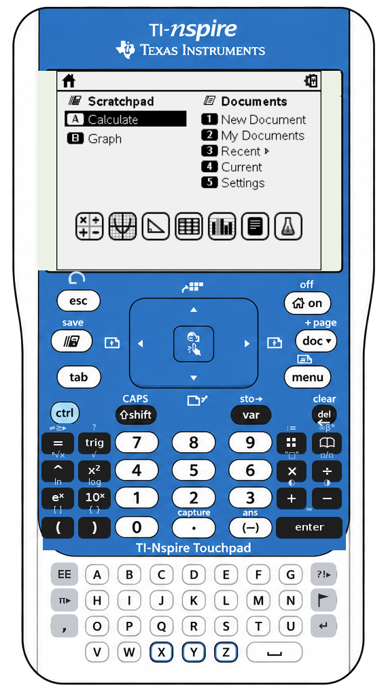
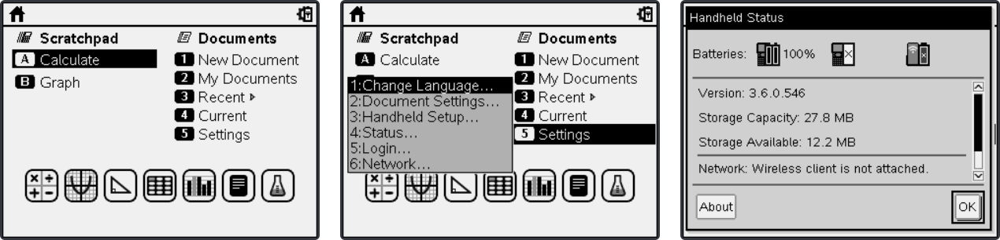

<div align="center">

# nRemote

### Control your TI-Nspire™ handheld from your computer.
Mirror its live screen, click an accurate on-screen faceplate, or just type on your keyboard. Works with a single handheld or a whole classroom.

[](https://github.com/james-coder/nRemote/actions/workflows/build.yml)
[](http://www.wtfpl.net/)




</div>

---

## What is nRemote?

**nRemote** is a small Java program that remote-controls one or more **TI-Nspire** handhelds connected to your PC or Mac, either directly over USB or through the TI-Navigator wireless system. It mirrors the handheld's screen in real time and sends key presses back to it, so you can drive the calculator entirely from your computer. It is handy for **classroom demonstrations**, **screen projection**, keeping every student's device **in sync**, or recording and replaying a set of keystrokes.

- 🖥️ **Live screen mirroring.** See the handheld's display update as you work.
- 🎛️ **Clickable faceplate.** An accurate picture of the TI-Nspire Touchpad; click any key. *(`--faceplate`)*
- ⌨️ **Type on your keyboard.** A→A, 1→1, Enter, arrows, Ctrl/Shift, and the rest go straight to the calculator.
- 🟢 **Sticky Ctrl and Shift.** Click a modifier to arm it for the next key (armed keys glow green on the faceplate), matching the handheld.
- 🐞 **Built-in debugger** for the emulated handheld: registers, disassembly, memory, stack and breakpoints. *(`--emulator --debugger`)*
- ⏺️ **Record and replay** key sequences to a file.
- 📁 **Drag and drop** `.tns` files onto the window to transfer them.
- 👥 **One or many** handhelds. Send to all connected devices, or a selected subset.
- ➗ **Math palettes** for trig, pi, symbols, and conditionals.

---

## A maintained fork

This repository is a **fork of [adriweb/nRemote](https://github.com/adriweb/nRemote)** by **Adriweb** and **Levak** of [TI-Planet](https://tiplanet.org), with calc-to-computer protocol help from Jim Bauwens.

> The upstream project received its **last commit in October 2015**, close to eleven years ago, and appears to be no longer maintained. It is still a genuinely clever piece of work that this fork owes everything to; all credit for the concept and original implementation belongs to its authors.

This fork picks up where it left off. Since **v1.9.0** it verifies behaviour against a real handheld (OS 3.6) and adds a substantial round of fixes and features:

- Fixed sticky Shift/Ctrl state that made dialog buttons unresponsive, maximize scaling that hid the keypad, and a rebuilt, thread-safe screen-refresh pipeline so keystrokes are no longer silently dropped.
- Corrected key names against TI's real key table (for example `10ˣ` and shift-click), and made the touchpad **center-click select** the highlighted item (the handheld ignores the raw click, so nRemote sends Enter).
- Robust sequence save and playback, better device-list handling, physical-keyboard support, and a startup retry dialog.
- A new **graphical faceplate** (`--faceplate`), a **build workflow**, and a **desktop icon and launcher**.

The full history is in the [Changelog](#changelog).

---

## Live screen mirroring

The handheld's screen is shown in real time, including menus, dialogs, and calculations:

<div align="center">

</div>

---

## Requirements

- **Java JRE 1.8 or newer.** The app itself targets Java 7, so it also runs on the JRE bundled with the TI software.
- **TI-Nspire computer software to provide the USB and wireless link**, version 3.6 or 3.9 (Navigator or not, Teacher or Student; any of them work). The free **[TI-Nspire Computer Link Software](https://education.ti.com/en/software/details/en/82035809F7E6474099944056CCB01C20/ti-nspire_computerlink)** is the simplest option, offered as a *Computer Link Software for Windows (EXE)* or *for Macintosh (DMG)* download. Note that the Computer Link Software is not compatible with CX II models. Because that software is Windows and Mac only, nRemote is too, though Linux users may find workarounds with WINE.

## Install

1. Install the [TI-Nspire Computer Link Software](https://education.ti.com/en/software/details/en/82035809F7E6474099944056CCB01C20/ti-nspire_computerlink) (Windows EXE or Mac DMG), if you do not already have TI-Nspire software.
2. Download **`nRemote.jar`** from the [latest release](https://github.com/james-coder/nRemote/releases/latest).
3. Browse to the folder where the TI-Nspire software is installed (for example `C:\Program Files (x86)\TI Education\TI-Nspire ...\` on Windows, or use *Show Package Contents* on Mac) and go into its Java or `lib` folder, the one that holds the other TI `.jar` files.
4. Copy **`nRemote.jar`** there, next to those TI `.jar` files.

> If the TI software then refuses to launch, start it first and drop `nRemote.jar` in afterwards.

## Usage

1. **Launch the TI-Nspire software first.**
2. Open **`nRemote.jar`** by double-clicking it, or run `java -jar nRemote.jar`.
3. To use the graphical faceplate instead of the text keyboard, launch it with **`--faceplate`**:
   ```
   java -jar nRemote.jar --faceplate
   ```

**Sticky Ctrl and Shift.** On both the faceplate and the text keyboard, **ctrl** and **shift** are *sticky*: click one and it arms for the **next** key, then clears itself, exactly like pressing the modifier on the handheld. So `ctrl` then `esc` sends the handheld's ctrl-esc, and `shift` then `a` types a capital `A`. On the faceplate an armed modifier turns **green**. This is how most calculator emulator front-ends behave, so there is no key to hold down.

**Debugger (emulator only).** With `--emulator`, adding `--debugger` opens a window onto the emulated machine: the register file with values that changed since the last stop highlighted, live disassembly at the PC, a memory view, the stack, and read/write/execute breakpoints. Halt, Continue, Step and Step Over are on the toolbar, double-clicking a disassembly line toggles a breakpoint, and a console pane takes any [Firebird](https://github.com/nspire-emus/firebird) debugger command directly. See [`docs/EMULATION.md`](docs/EMULATION.md).

**Hover to learn the keys.** On the faceplate, rest the pointer over any key to see a tooltip of what it does (the ctrl/shift tooltips also explain the sticky behaviour). A few keys that the handheld firmware ignores over the link, such as `e^x`, say so in their tooltip.

**Desktop shortcut and icon (Windows).** Copy `nRemote.jar` and [`nremote.ico`](nremote.ico) into that TI Java or `lib` folder, then run [`launcher/Create-Desktop-Shortcut.ps1`](launcher/Create-Desktop-Shortcut.ps1). You can also drop [`launcher/nRemote.bat`](launcher/nRemote.bat) next to the jar and double-click it. Either way you get a *nRemote* shortcut with the app icon that launches through the TI-bundled Java. See [`launcher/README.md`](launcher/README.md).

---

## Building and releasing

GitHub Actions ([`.github/workflows/build.yml`](.github/workflows/build.yml)) builds and tests the jar on every push. **The single source of the release version is the [`VERSION`](VERSION) file:** bump it, push to `master`, and CI publishes a new `v<version>` tag and GitHub Release with `nRemote.jar` attached (the app also reads this file to show its version). If the version has not changed, no new release is made.

The real TI NavNet libraries are proprietary and are **not** in this repo, so the code is compiled against signature-only stubs in [`ci/stubs/`](ci/stubs) whose method descriptors match the real classes. The result is a **"no-libs" jar** that contains only nRemote's own classes and resolves the real TI classes at runtime, once it is dropped next to them as the install steps describe. It is compiled to **Java 7 bytecode**, because the TI software bundles a Java 7 JRE.

```bash
# roughly what CI does (JDK 8):
javac -source 1.7 -target 1.7 -encoding UTF-8 -cp src/lib/Alpha.jar \
      -d build $(find ci/stubs -name '*.java') src/*.java
rm -rf build/com                                  # drop the compile-only stubs
cp src/load.png src/nremote.png src/faceplate.png build/
cp VERSION build/nremote-version.txt
jar cfm nRemote.jar src/META-INF/MANIFEST.MF -C build .
```

## Tests

- **Without a calculator (runs in CI):** [`tests/FaceplateMapTest.java`](tests/FaceplateMapTest.java) checks the clickable faceplate: every key is a real TI key name, every button's centre resolves to that button, and no hit box is malformed. It would have caught real past bugs such as the `~10_power_x~` typo and the mislabelled flag key.
- **With a calculator attached (run by hand):** [`tests/hardware/Probe.java`](tests/hardware/Probe.java) drives a real handheld through the same NavNet calls to verify key names, click-vs-Enter behaviour, and screen timing. It cannot run in CI (proprietary libraries and a device are required). See [`tests/README.md`](tests/README.md).

---

## Known issues

| Symptom | Status |
| --- | --- |
| Stuck connecting, or the TI software cannot see handhelds | Usually nRemote was launched **before** the TI software. Since v1.9.0 a retry dialog lets you start the TI software and try again. If the TI software itself got stuck, kill `java.exe` / `javaw.exe` and the TI software in Task Manager. |
| Mac GUI looks flat with red dots | A Java 1.6 / 1.7 conflict. Run it from a terminal: `java -jar nRemote.jar`. |
| Title says a device is connected but there is not | Largely fixed in v1.9.0 (the list refreshes on membership changes). Otherwise use the Refresh option in the TI software. |
| Some keys such as `e^x` do nothing | The handheld's firmware ignores a few remote keystrokes. That is a TI limitation, not an nRemote bug. Affected buttons carry a tooltip that says so. |

---

## Changelog

**Highlights.** v1.9.0 revived the fork with a large bug-fix round, verified on real hardware. v1.10 added the graphical faceplate, physical-keyboard typing, a control bar, and center-click-selects-item. v1.11 made the faceplate accurate to the real device and added a build workflow plus a desktop icon.

<details>
<summary>Full version history</summary>

- **v1.15.0** (Fork). Emulator backend. `--emulator[=host:port]` points nRemote at an emulated TI-Nspire ([Firebird](https://github.com/nspire-emus/firebird)) instead of a physical handheld, through the same GUI: the faceplate mirrors the emulated screen and sends it keys. Ships the Firebird-side bridge, the flash tooling, and a guided dumper (`tests/hardware/DumpBoot1.java`) for getting boot1 off your own handheld, which is the one piece nobody can download. The normal USB path is untouched when the flag is off. See [`docs/EMULATION.md`](docs/EMULATION.md).
- **v1.14.0** (Fork). The faceplate is now self-documenting: hover any key for a tooltip of what it does, and the ctrl and shift keys explain that they are sticky. The text keyboard's ctrl and shift gained the same tooltips, and the sticky behaviour is now described in the readme's Usage section.
- **v1.13.0** (Fork). Sticky ctrl and shift on the faceplate: clicking either arms it (shown with a green highlight) so it applies to the next key, then clears, matching the handheld's modifier behaviour and typical emulator front-ends.
- **v1.12.0** (Fork). Releases are the single download source, published automatically from the `VERSION` file. Added a calculator-free CI test for the faceplate and an on-device test harness.
- **v1.11.0** (Fork). Faceplate accuracy pass: two-per-row science and operator keys with their legends, the minus key, the undo symbol above esc, del's backspace arrow, and grey `EE` / `pi` / `,` / `?!` / flag / return keys with the flag key corrected. Added a build workflow, CI stubs, and a startup icon and launcher.
- **v1.10.2** (Fork). Faceplate live screen no longer double-exposes with the built-in screen graphic (the LCD is painted first, then the 4:3 screen is centred).
- **v1.10.1** (Fork). The touchpad center-click (and the CLIC button) now selects or activates the highlighted item. It is sent as Enter, since the handheld ignores the remote `~click~`.
- **v1.10.0** (Fork). Optional clickable TI-Nspire Touchpad faceplate (`--faceplate`) with the live screen overlaid, physical-keyboard typing, a control bar (record, load, screen, device), and drag and drop in faceplate mode.
- **v1.9.0** (Fork). First fork release: sticky-modifier fix, maximize scaling, rebuilt refresh pipeline (background fetch, EDT-safe updates, transport lock), Disable-Screen sizing, sequence save and playback robustness, device-list staleness, keyboard-input fixes, startup retry, and on-device key-name verification.
- **v1.8.1a** (Public). Fixed the real-time screen (TI had encapsulated the screen object).
- **v1.8.0a** (Public). Made compatible with 3.6 and 3.9 (dropped older versions).
- **v1.7.x** (Public). Additional separate screen frame; background work on two-way calc-to-computer communication (IRC, web, Wolfram Alpha).
- **v1.6** (Public). Screen auto-scaling on resize.
- **v1.5** (Public). Read-device selection, application icon, code cleanup.
- **v1.4** (Public). Drag-and-drop file transfer, calculator target selection.
- **v1.3** (Public release). Reduced delays, sequences.
- **v1.0 to v1.2** (Private). GUI, resizing, screen toggle.
- **v0.9 to v0.99** (Private). Console only, basic sendEvents.

</details>

---

## Credits and license

- **Original authors:** Adriweb and Levak, of [TI-Planet](https://tiplanet.org). Protocol help from Jim Bauwens.
- Released under the **[WTFPL](http://www.wtfpl.net/)**. Do what you want, but also thank the original authors, and visit [tiplanet.org](https://tiplanet.org).

*TI-Nspire and TI-Navigator are trademarks of Texas Instruments. This is an independent, unofficial tool.*
